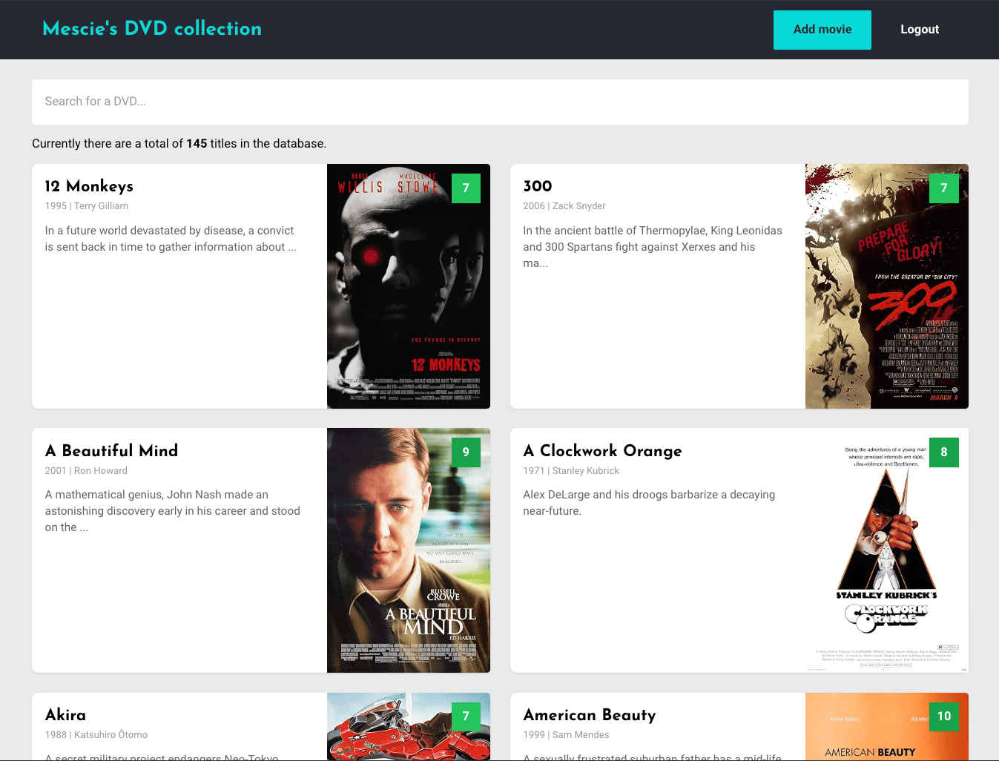

# DVD Collector



This project is a lightweight Vue.js application designed to help you manage and maintain a listing of your personal DVD collection. It integrates with Firebase for hosting and data storage, and utilizes the [OMDB](https://www.omdbapi.com/) API to fetch movie details. It fetches IMDB ratings but you can also add your own personal rating to titles. Managing your DVDs is behind a login that you can setup in Firebase.

## Getting Started

### 1. OMDB API

The app fetches movie information from the OMDB API. To use this feature, you’ll need to sign up and obtain an API key from [OMDB](https://www.omdbapi.com/).

### 2. Firebase Setup

To store your data, you’ll need to configure a Firebase database. Ensure you have a Firebase project set up and add your credentials to the `.env` file.

#### Firebase Hosting

This app is deployed using Firebase Hosting. To deploy updates:

1. Install the [Firebase CLI](https://firebase.google.com/docs/cli).
2. Run `firebase deploy` to push the latest version.

Make sure your Firebase authentication and permissions are properly configured. You’ll need to create a user account for logging in.

### Firebase Security Rules

Ensure your Firestore database rules are set to the following:

```javascript
rules_version = '2';
service cloud.firestore {
  match /databases/{database}/documents {
    match /{document=**} {
      // Allow anyone to read the data
      allow read: if true;

      // Allow write only if the user is authenticated
      allow write: if request.auth != null;
    }
  }
}
```

This configuration allows anyone to read the data, but only authenticated users can write to the database.

## Recommended IDE Setup

[VSCode](https://code.visualstudio.com/) + [Volar](https://marketplace.visualstudio.com/items?itemName=Vue.volar) (and disable Vetur) + [TypeScript Vue Plugin (Volar)](https://marketplace.visualstudio.com/items?itemName=Vue.vscode-typescript-vue-plugin).

## Type Support for `.vue` Imports in TS

TypeScript cannot handle type information for `.vue` imports by default, so we replace the `tsc` CLI with `vue-tsc` for type checking. In editors, we need [TypeScript Vue Plugin (Volar)](https://marketplace.visualstudio.com/items?itemName=Vue.vscode-typescript-vue-plugin) to make the TypeScript language service aware of `.vue` types.

If the standalone TypeScript plugin doesn't feel fast enough to you, Volar has also implemented a [Take Over Mode](https://github.com/johnsoncodehk/volar/discussions/471#discussioncomment-1361669) that is more performant. You can enable it by the following steps:

1. Disable the built-in TypeScript Extension
   1. Run `Extensions: Show Built-in Extensions` from VSCode's command palette
   2. Find `TypeScript and JavaScript Language Features`, right click and select `Disable (Workspace)`
2. Reload the VSCode window by running `Developer: Reload Window` from the command palette.

## Customize configuration

See [Vite Configuration Reference](https://vitejs.dev/config/).

## Project Setup

```sh
npm install
```

### Compile and Hot-Reload for Development

```sh
npm run dev
```

### Type-Check, Compile and Minify for Production

```sh
npm run build
```

### Lint with [ESLint](https://eslint.org/)

```sh
npm run lint
```
